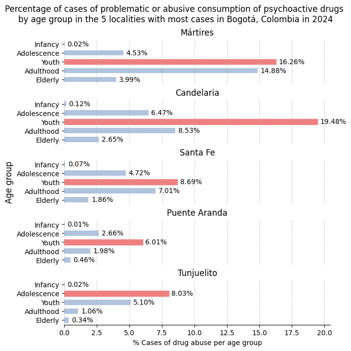
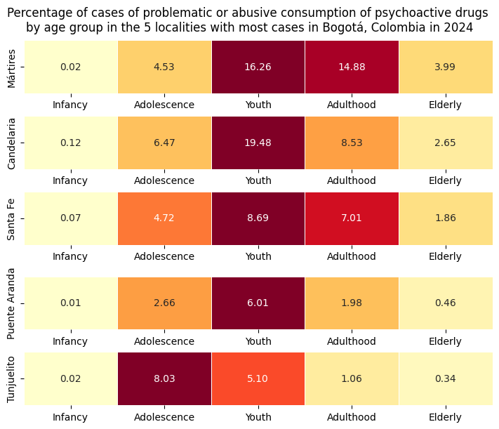

# Psycoactive_Substance_ Abuse
This project is a part of the Angela Palacino's Data Science projects.

### Project Status: [Completed] :white_check_mark:

## Project Intro/Objective
The purpose of this project is to explore the behaviour of reported cases of psychoactive substance abuse, this is done graphically and with statistical testing.

### Methods Used
* Inferential Statistics
* Data Visualization
* Data processing

### Technologies
* Python
* Pandas, jupyter
* Scipy
* Matplotlib

## Project Description
In this project I took data available from the open data website of the city of Bogotá, Colombia. Two data sets were used:
- [Cases of problematic or abusive consumption of psychoactive substances](https://datosabiertos.bogota.gov.co/dataset/50b957e1-7ee6-4a69-8fb3-d79f2b6c9f73): This data set contains the number of cases reported by locality, sex, age group, habitual consumption location and others for the years 2005 to 2024.
- [Population of Bogotá](https://datosabiertos.bogota.gov.co/dataset/piramide-poblacional-bogota-d-c): This data set contains the population by age, locality and sex from 2005 to 2030. 

Both data set are up to date according to the information on the open data website of the city.

First, an initial profiling of both data sets is performed with the ydata-profiling package. Second, visualizations are used to see the behaviour of the cases of consumption of drugs through the years and age groups, usign bar plots. Later on, the information from the drug consumption data set and the population dat set are combined to determine the number of cases per habitant and graph the tendency of the consumption in the localities with most cases across age groups. Furthermore, a statistical test for independence is performed to evaluate the association between locality and age groups. 

## Needs of this project

- data exploration/descriptive statistics
- data processing/cleaning

## Getting Started

1. Clone this repo (for help see this [tutorial](https://help.github.com/articles/cloning-a-repository/)).

2. Raw Data is being kept [data/raw](https://github.com/APalacino/psycho_substance_abuse/tree/develop/data/raw) within this repo.
    
3. Data processing/transformation scripts are being kept [notebooks](https://github.com/APalacino/psycho_substance_abuse/tree/develop/notebooks)

4. Reports generated during data analysis are being kept [reports](https://github.com/APalacino/psycho_substance_abuse/tree/develop/reports)

## Results

Cases of drug abuse in localities across Bogotá are highly dependent on the location of the locality when taking int acount the cases per habitants, therefore the graphs are presented as a percenage of cases per age group. The first four localities with most cases are located in an axe in the center of the city, and they present more cases in the youth. Specially La Candelaria which has almost 10 percentage points above the following age groups, like adolescence and adulthood. To reduce these cases there should be efforts directed at the adolescence age group to prevent further problematic abuse of psychoactive substances, a behaviour observed in Tunjuelito (the fifth locality). Additionally, it is seen that fortunately there are very few cases in the first infancy. We can also see that in the elderly the first three localities (Mártires, Candelaria and Santa Fe) have a percentage of cases above 1% that is not seen in the other localities. These graphs show there might be an association between the locality and age groups when it comes to drug abuse.

## Contact
e-mail: appalacinoc@gmail.com

LinkedIn: https://www.linkedin.com/in/angela-palacino/